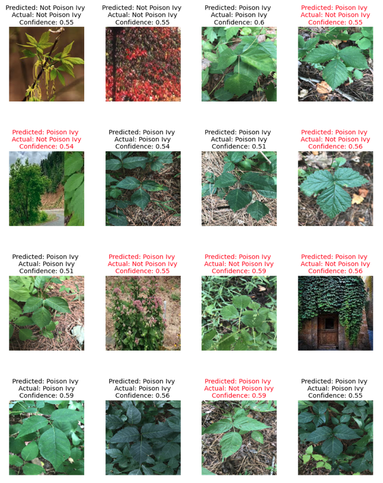

# Capstone 2 - Poison Ivy Image Classification

 <a href="https://docs.google.com/presentation/d/1hFrvHSjNF6NvDbf2mni8I0o5brxn3wShvWCH1NCnZ6w/edit#slide=id.g35f391192_00">Presentation</a>

## Table of Contents
- [Background](#background)
- [Data](#data)
- [Models](#models)
- [Results](#results)
- [Future Steps](#future-steps)

## Background
The purpose of this project is to create a model that is able to classify images correctly as either poison ivy or not. On a large scale, natural resource managers should be informed on the plants that they're working with and whether or not it'd be a good idea to keep or remove a plant. In addition, I come from a previous job working on a golf course where I frequently found myself fighting the plant and wanted to create a tool that would help myself in the future.

## Data
The main dataset for this project comes from images I webscraped off of Google Images in addition to [this dataset pre-made off GitHub](https://github.com/bazilione/poison_ivy). I wanted to include webscraped images to add more complexity to the problem and to practice webscraping. In total there are approximately 2050 images (1600 webscraped & 440 provided by second dataset). There are 5 total labels for this classification problem; poison ivy, virginia creeper, box elder, boston ivy, and skunkbush. I intentionally choose plants that are commonly mistaken for poison ivy to again, add complexity, but also practicality. The dataset is balanced, with ~55% of the images being poison ivy and ~45% not. An example of some the images is provided below.

## Models

### Baseline
I tested two models in addition to a baseline model for this project. The baseline model was comprised of a simple, two layer deep CNN with maxpooling. It achieved a peak accuracy of 66.34%, 62.57% precision, 97.43% recall, and .66 loss on the training data. However, when using the testing images it was about as accurate as a coin flip.

The model isn't very confident in any of it's predictions and frequently gets it wrong.

It predicted almost every image as poison ivy and since the data is fairly balanced, achieved a less impressive result than the training accuracy, precision, and recall.

### VGG16
Utilizing transfer learning, the VGG16 model improved dramatically from the baseline. It achieved a peak accuracy of 78.53%, precision of 79.26%, recall of 82.29%, and loss of .51 on the training images.

The image plot shows the dramatic improvement from the baseline, but still has room for improvement. It's interesting to note which images it **predicted confidently, but still got wrong**, like the picture in the second column, third row. This is an image of skunkbush and doesn't include any colors or edges similar to poison ivy so I was a bit perplexed as to why the NN was so confident in it's predictions. It's also interesting to look at which images it **correctly predicted with low confidence**, like the picture in the third row, fourth column. I suspect the low confidence is due to poor lighting and edges that are difficult to detect with more plants underneath the leaf in focus. 

The VGG also was able to learn which plants were *not* poison ivy as you can tell from the true negatives box in the confusion matrix predictions.

### ResNet34
The other model I trained during this process was a ResNet34 model. Again I utilized transfer learning and was able to achieve a peak accuracy of 83.41%, precision of 79.62%, recall of 93.78%, and loss of .45 on the training images.

This image plot did about as well as the VGG16 model on the test images. It's overall accurate, but still makes mistakes on predictions it's very confident in and predicts images correctly that it has low confidence in. The difference between the two models can be seen in the following confusion matrix.

The ResNet model mimized false negatives very well, which I think given the context of the problem is really important. You'd rather have the model be over cautious and predict something as poision ivy when it's really not as opposed to predicting a plant as not poison ivy only for you to find out later that it actually was. From an individual standpoint I think this is the better of the two scenarios. However, thinking from a resource manager standpoint that might mean the removal of plants that you wish you had kept in hindsight. So ideally you want to minimze both false negatives *and* false positives. However, for this project's purpose I was very happy with the result.

## Results 
I've already talked about these numbers when introducing each neural network, but these are the models compared side by side. As you can see the ResNet34 model just slightly outperforms the VGG16 model.

## Future Steps
- Continued adjustments to model’s hyperparameters
- Train models further from their best checkpoint
- Multi-classification - specify type of plant rather than binary outcome of "poison ivy" or "not poison ivy"
- Get a fourth model working (Xception)
